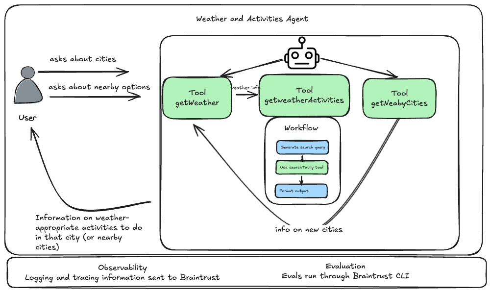
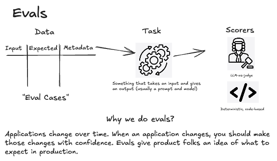
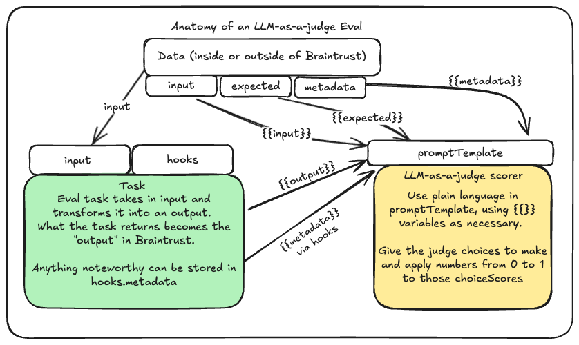
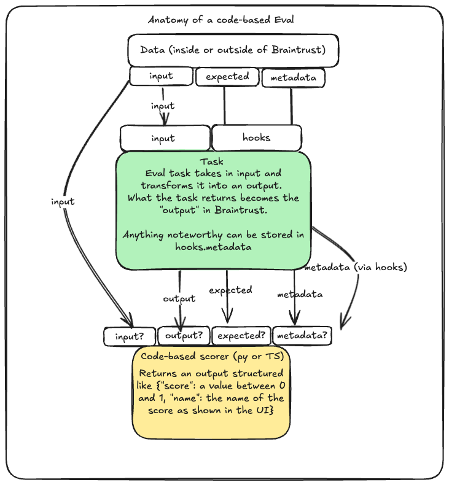

# Evals through the SDK Workshop

## Background

This project is meant to go beyond the Braintrust documentation to show how to perform evaluations outside of "Hello, World!" style examples. This repository is a Next.js chatbot application which uses a [Mastra](https://mastra.ai/en/docs) agent and workflow to get the weather of a location and then deliver suggested activities.

The Mastra agent has three two tools available to it:
- A tool that fetches the weather from an API for a given location.
- A tool that wraps around a [Mastra workflow](https://mastra.ai/en/docs/workflows/overview) which uses the [Tavily API](https://docs.tavily.com/welcome) to do a search and pull back interesting things to do based upon the city and weather.
- A tool that uses a prompt to gather two nearby cities.

Braintrust is performing logging and tracing on the Agent and associated tools. Engineers can run Braintrust Evals through the `evals/conversation.eval.ts` file.

A diagram of the Agent:




## Getting Started
### Prerequisites
When running this example, you will need to provide the following to a `.env` file:
- `**OpenAI_API_KEY**`: An OpenAI API Key. Used for LLM calls
- `**TAVILY_API_KEY**`: A Tavily API Key. Used for the search tool.
- `**BRAINTRUST_API_KEY**`: A Braintrust API Key. Used to interact with Braintrust for observability and evaluation.
- `**BRAINTRUST_PROJECT_NAME**`: A unique Braintrust project name (e.g., "YourName_MastraApp"). Used to host your Braintrust assets.
There is a file named `.env.example` to show how this would look in your repo. Create a file called `.env` and assign values for these environment variables.

You will also need `node`/`npm` installed on your machine.

### Setting up the development environment

#### Create your `.env` file
Make sure that your `.env` file has values for the four environment variables listed above

#### Run the Next.js app
To run the application, use the following command line script:

```bash
npm run dev
```
#### Open the application
Open [http://localhost:3000/test](http://localhost:3000/test) with your browser to see the result.

#### Setup necessary Braintrust assets

You'll need to configure a Braintrust project and Braintrust dataset. This repository provides a convenience script to perform these actions

```bash
npm run setup
```

## What is an Eval?

### Description
An Eval is a way to judge the quality of some task or function's output. Usually that task is an LLM and prompt but that is not always the case. Evals are made up of three things:
- **Data**: An array of inputs that you want to place into a task to create outputs. Can also include the expected values after a task transforms the input as well as any metadata of interest.
- **Task**: Some function that takes an input and transforms it. Usually an LLM and prompt but can be either more or less complex.
- **Scorers**: A function that judges the quality of an output between 0 and 1. Judgement can be made via an LLM-as-a-judge or a deterministic code-based function.



### What does an Eval look like:

```typescript
Eval("Name of your Braintrust Project", {
    task: task, // your task function's identifier. The Eval assumes that the tasks has arguments of input and hooks
    data: initDataset({project: projectName, dataset: "WeatherActivityDataset"}), // your data with inputs and optional metadata and expected fields. This example pulls a dataset from Braintrust directly however you can load any data into an Eval as long as it has a field called "input"
    scores: [toolCallCheck, structureCheck, faithfulnessCheck] // function identifiers for scores.
});
```

### How do I run an Eval?

In Braintrust, Eval experiments can be run via the command line. If writing your evals in TypeScript, you can initiate a Braintrust experiment by running:

```bash
npx braintrust eval path/to/eval/yourfilename.eval.ts
```

## How do Eval tasks work?

Eval tasks are a blank slate - usually Eval tasks are a combination of a prompt and a model; however, Eval tasks can be much more complicated (or even much simpler) than that! When setting up an Eval task, create a function that has two arguments: `input` and `hooks`.
- `input`: When running `Eval()` in Braintrust, `Eval()` is going to pass the `data`'s input field dynamically to the function assigned to the `task` argument. Inputs can be as simple as a string or as complex as a multi turn conversation with multi-modal attachments. 
- `hooks`: Hooks is an object that you can use to either retrieve or write metadata to an Eval task. An example: let's imagine that you are running a RAG pipeline. The output returned by your task should be the assistant's final reponse but you may want to keep the context that your LLM brought back from a vector dataset. You can assign the context brought back from the vector database to `hooks.metadata.context`, and then retrieve that information later in a scoring function.

```typescript
async function task(input: any, hooks: any) {
    // transform your input to create an output
    const taskOutput = input + "how's this for a transformation?"

    // write to a task's metadata
    hooks.metadata.valueYouWantLater = "See you in the scoring function!"

    // send the task's output to a scoring function
    return taskOuput;
}
```

## Creating a custom LLM-as-a-Judge scrorer

Often you will want to create an LLM with a prompt that determines the quality of another LLM's output. Braintrust enables engineers to create custom LLM scorers through the `LLMClassifierFromTemplate()` function in the `autoevals` package. The function takes several arguments
- `name`: What you want to call the LLM-as-a-judge in the Braintrust Experiment results
-  `promptTemplate`: Describes in plain language what you want the prompt to judge. You can insert variables into the prompt template by using  `{{mustache}}` references. Within the prompt, you should be precise about what you want the LLM to judge. Give specific choices ("a", "b", "c") to the judge within the language of the promptTemplate which will match with the choices in the `choiceScores` argument. Common variables to insert into prompts are:
    - `{{input}}`: Is derived from the evaluation case dataset's input field.
    - `{{output}}`: Is derived from the Eval task's returned output
    - `{{expected}}`: Is derived from the evaluation case dataset's expected field
    - `{{metadata}}`: Is derived from both the evaluation case dataset's metadata field OR any information written to `hooks.metadata` during the task's execution
- `choiceScores`: A mapping of 0-1 scores associated with each possible choice
- `model`: The LLM that you want to use for scoring
- `useCOT`: Whether or not you want the prompt to be appended with chain-of-thought reasoning. Not to be confused with the reasoning component of newer models



## Creating a custom code-cased scorer

You can also create a function to score the outputs of your Eval task. Like Eval tasks, code based scorers can be of arbitrary complexity. They can (but don't always have to) take four arguments:
- `input`: Is derived from the evaluation case dataset's input field.
- `output`: Is derived from the Eval task's returned output
- `expected`: Is derived from the evaluation case dataset's expected field
- `metadata`: Is derived from both the evaluation case dataset's metadata field OR any information written to `hooks.metadata` during the task's execution



## Homework
Here are some things you could improve in the current Evals if you want to learn by doing:
1. The structureCheck scorer doesn't take into account situations where the user goes off topic. Adjust this eval to ignore these cases.
2. Faithfulness takes into account the specific numbers (degrees, humidity, wind) in the expected value.
3. Use LLM-as-a-judge to determine if suggested activities are really influenced by weather.


